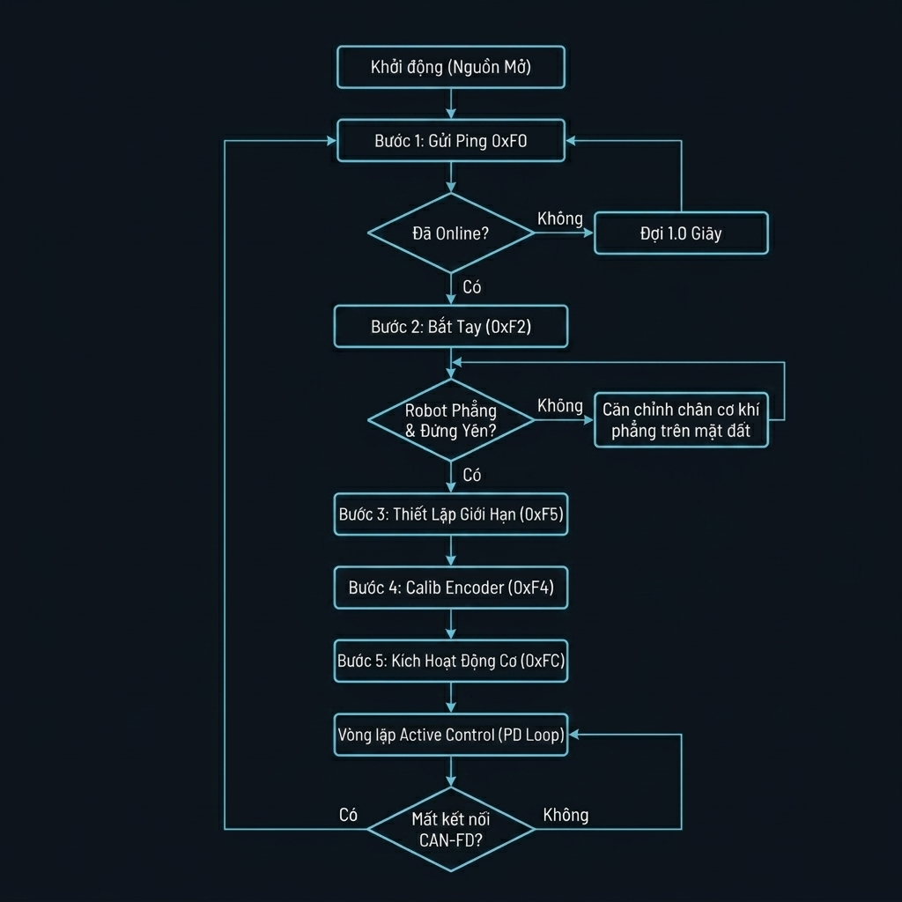

# 📋 TÀI LIỆU TÍCH HỢP HỆ THỐNG VÀ LẬP TRÌNH ĐIỀU KHIỂN ĐỘNG CƠ CAN-FD (MASTER DEVELOPER MANUAL)
**Tài liệu hướng dẫn phát triển phần mềm Master, bóc tách bản tin và vận hành cụm 6 khớp chân sau**

Tài liệu này đặc tả giao thức truyền thông nhị phân CAN-FD, công thức quy đổi vật lý, sơ đồ trình tự khởi tạo và cấu trúc bóc tách bản tin cho cụm 6 động cơ thông minh khớp chân sau của robot (tương tự với 6 chân trước).

---

## 1. TRÌNH TỰ KHỞI TẠO HỆ THỐNG VÀ LƯU ĐỒ HOẠT ĐỘNG

Mỗi khi hệ thống phần cứng được cấp nguồn điện ổn định trong dải `24V - 28V`, driver của các động cơ sẽ ở trạng thái chờ tĩnh. Master phải thực hiện truyền lần lượt **5 bản tin khởi tạo hệ thống** dưới đây theo đúng trình tự thời gian cho từng động cơ (CAN ID từ `0x001` đến `0x006`) để khởi tạo và kích hoạt công suất.

### 1.1. Lưu đồ tiến trình khởi tạo và khôi phục kết nối (Initialization & Recovery Decision Flowchart):
Dưới đây là lưu đồ chi tiết thể hiện các khối xử lý rẽ nhánh điều kiện và vòng lặp tự động khôi phục kết nối khi động cơ bị mất kết nối đột ngột hoặc được rút ra cắm lại khi hệ thống đang chạy (cắm nóng - hot-plug):




### 1.2. Bảng chẩn đoán trạng thái các bước khởi tạo:

| Bước | Bản tin Gửi (Tx) | Lệnh Hex (`Byte 11`) | Trạng thái Động cơ trước lệnh | Trạng thái / Hành vi sau lệnh | Mục đích kỹ thuật |
| :---: | :--- | :---: | :--- | :--- | :--- |
| **Bước 1** | `Ping` | `0xF0` | **Offline** (Chưa kết nối logic). | Chuyển sang trực tuyến, sẵn sàng nhận truy vấn bắt tay. | Thăm dò định danh động cơ online trên mạng bus CAN. |
| **Bước 2** | `Handshake` | `0xF2` | Trực tuyến nhưng chưa kiểm tra. | Phản hồi thông tin phiên bản phần cứng/phần mềm. | Đăng ký thiết bị và xác nhận độ tương thích phần cứng. |
| **Bước 3** | `Setup Limits` | `0xF5` | Hoạt động với giới hạn mặc định. | Động cơ ghi nhớ dải góc chặn và tốc độ cực đại. | Nạp biên giới hạn bão hòa vị trí để bảo vệ khớp. |
| **Bước 4** | `Calib Encoder` | `0xF4` | Chưa đồng bộ điểm không vật lý. | Động cơ nạp offset, đồng bộ góc khớp hiện tại về $0$. | Thiết lập điểm không chuẩn hóa cho khớp chân. |
| **Bước 5** | `Motor Enable` | `0xFC` | Khớp thả lỏng tự do (**Passive**). | Động cơ đóng điện cầu H, chủ động giữ cứng khớp (**Active**). | Khóa cứng khớp chân, sẵn sàng nhận lệnh điều khiển PD. |

---

## 2. ĐẶC TẢ CHI TIẾT CÁC BẢN TIN QUẢN LÝ & KHỞI TẠO (Tx / Rx)

Toàn bộ các bản tin hệ thống gửi từ Master (Tx) đều có độ dài cố định **DLC = 12 Bytes**, bắt đầu bằng Header **`0xF0`** ở Byte 0 và mã lệnh thực thi ở Byte 11. Các byte ở giữa được đệm trống bằng `00` nếu không dùng đến.

### 2.1. Bản tin Ping (Thăm dò trạng thái kết nối)
*   **Bản tin gửi đi (Tx - DLC = 12 Bytes):**
    ```text
    F0 00 00 00 00 00 00 00 00 00 00 F0
    ```
    *   `Byte 0 = 0xF0`: Header định dạng lệnh hệ thống.
    *   `Byte 1 - 10 = 00 ... 00`: Các byte đệm trống.
    *   `Byte 11 = 0xF0`: Mã lệnh Ping.
*   **Bản tin phản hồi (Rx - 12 Bytes - Gửi về ID `0x000`):**
    Động cơ khi trực tuyến sẽ phản hồi ngay lập tức bằng **Bản tin Bắt tay (Handshake Rx)** để thông báo trạng thái Online:
    *   `Byte 0 = 0x08 + Motor_ID` (Ví dụ: Motor 1 trực tuyến phản hồi byte đầu là `0x09` để báo hiệu trạng thái Online).
    *   `Byte 1 - 11 = Dữ liệu thô hệ thống (Chưa giải mã chi tiết / Reserved)`.
    *   *Ví dụ bản tin phản hồi thô thực tế từ Motor 1*:
        ```text
        09 03 15 00 03 06 01 12 03 02 00 00
        ```
        (Trong đó `Byte 0 = 0x09` định danh Motor 1 Online, các byte còn lại từ Byte 1 đến Byte 11 là thông tin phiên bản phần cứng/phần mềm thô của thiết bị).

### 2.2. Bản tin Bắt tay / Đọc phiên bản (Handshake Query & Response)
*   **Bản tin gửi đi (Tx - DLC = 12 Bytes):**
    ```text
    F0 09 00 00 00 00 00 00 00 00 00 F2
    ```
    *   `Byte 0 = 0xF0`: Header định dạng lệnh hệ thống.
    *   `Byte 1 = 0x09`: Tham số truy vấn thông tin chi tiết phiên bản.
    *   `Byte 2 - 10 = 00 ... 00`: Các byte đệm trống.
    *   `Byte 11 = 0xF2`: Mã lệnh Handshake.
*   **Bản tin phản hồi (Rx - 12 Bytes - Gửi về ID `0x000`):**
    *   `Byte 0 = 0x18 + Motor_ID` (Ví dụ: Motor 1 trả về `0x19` để báo hiệu trực tuyến).
    *   `Byte 1 - 11 = Dữ liệu thô hệ thống (Chưa giải mã chi tiết / Reserved)`.
    *   *Ví dụ phản hồi thực tế của Motor 1*: `19 XX XX XX XX XX XX XX XX XX XX XX` (chỉ giải mã chắc chắn Byte 0 định danh ID động cơ trực tuyến, toàn bộ dữ liệu từ Byte 1 đến Byte 11 được giữ nguyên ở dạng thô chưa giải mã chi tiết).

### 2.3. Bản tin Cấu hình giới hạn biên an toàn (Setup Limits - `0xF5`)
*   **Bản tin gửi đi (Tx - DLC = 12 Bytes):**
    ```text
    F0 [p_max (2B)] [p_min (2B)] [v_max (2B)] 00 00 00 00 F5
    ```
    *   `Byte 0 = 0xF0`: Header định dạng lệnh hệ thống.
    *   `Byte 1 - 2 = p_max`: Giới hạn vị trí góc cực đại (Hex 2 Bytes, Big-Endian).
    *   `Byte 3 - 4 = p_min`: Giới hạn vị trí góc cực tiểu (Hex 2 Bytes, Big-Endian).
    *   `Byte 5 - 6 = v_max`: Giới hạn tốc độ xoay tối đa (Hex 2 Bytes, Big-Endian).
    *   `Byte 7 - 8 = kp_max`: Giới hạn Kp tối đa, mặc định nạp `00 00` (cấu hình bypass để Master tự do chỉnh định Kp sau này).
    *   `Byte 9 - 10 = tau_max`: Giới hạn mô-men xoắn tối đa, mặc định nạp `00 00` (mở tối đa lực cơ học $24.0$ N.m).
    *   `Byte 11 = 0xF5`: Mã lệnh Setup.
*   **Bản tin phản hồi xác nhận (Rx - 12 Bytes - Gửi về ID `0x000`):**
    Driver động cơ xác nhận cấu hình bằng cách gửi lại (echo) các giá trị đã nạp kèm cờ trạng thái thành công ở Byte 1. Bản tin phản hồi được thiết kế **cố định 12 Bytes**:
    *   `Byte 0 = 0x38 + Motor_ID` (ví dụ: Motor 1 phản hồi byte đầu là `0x39`).
    *   `Byte 1 = 0x01` (Cờ xác nhận cấu hình thành công).
    *   `Byte 2 - 3 = p_max` (2 Bytes trích xuất xác nhận).
    *   `Byte 4 - 5 = p_min` (2 Bytes trích xuất xác nhận).
    *   `Byte 6 - 7 = v_max` (2 Bytes trích xuất xác nhận).
    *   `Byte 8 - 11 = 00 00 00 00` (4 bytes đệm trống).

### 2.4. Bản tin Calib Encoder (Căn lề điểm không - `0xF4`)
*   **Bản tin gửi đi (Tx - DLC = 12 Bytes):**
    ```text
    F0 04 4C 00 00 00 00 00 00 00 00 F4
    ```
    *   `Byte 0 = 0xF0`: Header định dạng lệnh hệ thống.
    *   `Byte 1 - 2 = 0x044C`: Giá trị offset hiệu chuẩn điểm không encoder tuyệt đối (`1100` thô).
    *   `Byte 3 - 10 = 00 ... 00`: Các byte đệm trống.
    *   `Byte 11 = 0xF4`: Mã lệnh hiệu chuẩn điểm không.
*   **Bản tin phản hồi (Rx - 12 Bytes - Gửi về ID `0x000`):**
    *   `Byte 0 = 0x28 + Motor_ID` (ví dụ: Motor 1 trả về `0x29`).
    *   `Byte 1 = 0x01` (Cờ xác nhận calib thành công).
    *   `Byte 2 - 3 = Offset` (2 Bytes trích xuất xác nhận lại giá trị offset, ví dụ `0x044C`).
    *   `Byte 4 - 11 = 00 00 ... 00` (8 bytes đệm trống).

### 2.5. Bản tin Kích hoạt động cơ (Motor Enable - `0xFC`)
*   **Bản tin gửi đi (Tx - DLC = 12 Bytes):**
    ```text
    F0 00 00 00 00 00 00 00 00 00 00 FC
    ```
    *   `Byte 11 = 0xFC`: Mã lệnh đóng điện cầu H kích hoạt trạng thái chủ động.
*   **Bản tin phản hồi (Rx - 12 Bytes - Gửi về ID `0x000`):**
    Động cơ trả về chuỗi Telemetry thời gian thực chứa trạng thái kích hoạt thành công với cờ trạng thái (Byte 10-11) chuyển đổi sang **`01 22`** (báo hiệu cầu H đã đóng điện kích hoạt lực và sẵn sàng nhận lệnh điều khiển).
    *   *Ví dụ phản hồi thực tế của Motor 3*: `03 80 2A 7F FF 7F FF 00 22 22 01 22` (Trong đó `Byte 10-11 = 01 22` báo hiệu trạng thái hoạt động bình thường Active).

### 2.6. Bản tin Tắt động cơ / Ngắt lực khẩn cấp (Motor Disable - `0xFD`)
*   **Bản tin gửi đi (Tx - DLC = 12 Bytes):**
    ```text
    F0 00 00 00 00 00 00 00 00 00 00 FD
    ```
    *   `Byte 11 = 0xFD`: Mã lệnh ngắt điện cầu H đưa khớp về trạng thái thả lỏng cơ học.
*   **Bản tin phản hồi (Rx - 12 Bytes - Gửi về ID `0x000`):**
    Động cơ trả về chuỗi Telemetry trạng thái với cờ trạng thái (Byte 10-11) chuyển đổi về **`00 00`** (Passive Standby / Cầu H ngắt điện hoàn toàn) hoặc **`01 00`** (Ready Standby).
    *   *Ví dụ phản hồi thực tế của Motor 3*: `03 80 2A 7F FF 7F F4 00 22 22 00 00` (Trong đó `Byte 10-11 = 00 00` dạng Little-Endian, thể hiện trạng thái cầu H đã ngắt điện hoàn toàn).

---

## 3. CÔNG THỨC QUY ĐỔI THAM SỐ VẬT LÝ <-> HEX MÃ HÓA (2 BYTES BIG-ENDIAN)

Tất cả các tham số truyền và nhận trên bus CAN-FD đều sử dụng định dạng lưu trữ **Hex 2 Bytes Big-Endian** (Byte cao xếp trước, Byte thấp xếp sau).

### 3.1. Quy đổi Tọa độ Góc (Vị trí $q$):
Hệ thống sử dụng hai dải tỉ lệ mã hóa khác nhau giữa Lệnh điều khiển ($p_{\text{des}}$) và Giới hạn/Telemetry ($p_{\text{max}}, p_{\text{min}}, p_{\text{act}}$) để tối ưu hóa độ phân giải. Đây là điểm mấu chốt kỹ sư lập trình Master cần lưu ý.

#### A. Đối với Lệnh điều khiển góc đích ($p_{\text{des}}$):
Sử dụng mã hóa Offset-Binary 16-bit trên dải vật lý đối xứng `[-16.384, 16.384]`:
*   **Mã hóa (Vật lý -> Hex thô 2 Bytes):**
    1.  Chuyển Độ sang Radian: $q_{\text{rad}} = q_{\text{deg}} \times \frac{\pi}{180}$
    2.  Tính giá trị thô: $p_{\text{des-raw}} = \text{round}\left( \frac{q_{\text{rad}}}{16.384} \times 32768 \right) + 32768$
    3.  Chuyển $p_{\text{des-raw}}$ sang định dạng Hex 2 Bytes Big-Endian.
*   **Giải mã (Hex thô 2 Bytes -> Vật lý):**
    1.  Tính Radian: $q_{\text{rad}} = \frac{p_{\text{des-raw}} - 32768}{32768} \times 16.384$
    2.  Tính Độ: $q_{\text{deg}} = q_{\text{rad}} \times \frac{180}{\pi}$

#### B. Đối với Giới hạn góc ($p_{\text{max}}, p_{\text{min}}$) và Vị trí thực tế phản hồi ($p_{\text{act}}$):
Sử dụng mã hóa Offset-Binary 16-bit trên dải vật lý rộng hơn `[-32.768, 32.768]` để chống tràn dữ liệu:
*   **Mã hóa (Vật lý -> Hex thô 2 Bytes):**
    1.  Tính giá trị thô: $\text{raw} = \text{round}\left( \frac{q_{\text{rad}}}{32.768} \times 65535 \right) + 32768$
    2.  Chuyển `raw` sang định dạng Hex 2 Bytes Big-Endian.
*   **Giải mã (Hex thô 2 Bytes -> Vật lý):**
    1.  Tính Radian: $q_{\text{rad}} = \frac{\text{raw} - 32768}{65535} \times 32.768$
    2.  Tính Độ: $q_{\text{deg}} = q_{\text{rad}} \times \frac{180}{\pi}$

*   **Ví dụ thực tế**: Quy đổi giới hạn góc khớp gối BL Calf tối đa $129.81^\circ$:
    1.  $q_{\text{rad}} = 129.81^\circ \times \frac{\pi}{180} \approx 2.265646$ rad.
    2.  $\text{raw} = \text{round}\left( \frac{2.265646}{32.768} \times 65535 \right) + 32768 = 37299$.
    3.  `37299` thập phân $\rightarrow$ Hex: `0x91B3` $\rightarrow$ Byte cao = `91`, Byte thấp = `B3`.

### 3.2. Quy đổi Vận tốc Góc (Tốc độ $v$):
*   **Mã hóa Lệnh điều khiển vận tốc đích ($v_{\text{des}}$) - Dải vật lý `[-45.0, 45.0]` rad/s:**
    *   $\text{raw} = \text{round}\left( \frac{v_{\text{des-rad/s}}}{45.0} \times 32768 \right) + 32768$
*   **Mã hóa Giới hạn vận tốc ($v_{\text{max}}$) trong bản tin Setup Limits:**
    *   $\text{raw} = \text{round}(v_{\text{rad/s}} \times 1000.0)$
    *   *Ví dụ*: Tốc độ tối đa từ log hệ thống $32.94$ rad/s $\rightarrow$ $\text{raw} = 32940$ $\rightarrow$ Hex: `0x80AC` (Khớp hoàn toàn với byte `80 AC` trong Kịch bản B).
*   **Giải mã Vận tốc thực tế phản hồi ($v_{\text{act}}$) - Dải vật lý `[-45.0, 45.0]` rad/s:**
    *   $v_{\text{act}} = \frac{v_{\text{act-raw}} - 32768}{65535} \times 90.0$ (rad/s)

### 3.3. Quy đổi Hệ số PD Control ($Kp, Kd$):
*   **Quy đổi Kp (Hệ số cứng vững):**
    *   $\text{raw} = \text{round}(Kp \times 100.0)$ (Dải vật lý: `[0.0, 5.0]` N.m/rad, dải thô tương ứng: `[0, 500]`).
    *   *Ví dụ*: $Kp = 4.0$ N.m/rad $\rightarrow$ $\text{raw} = 400$ $\rightarrow$ Hex: `0x0190`.
*   **Quy đổi Kd (Hệ số giảm chấn):**
    *   $\text{raw} = \text{round}(Kd \times 100.0)$ (Dải vật lý: `[0.0, 40.0]` N.m.s/rad, dải thô tương ứng: `[0, 400]`).
    *   *Ví dụ*: $Kd = 4.0$ N.m.s/rad $\rightarrow$ $\text{raw} = 400$ $\rightarrow$ Hex: `0x0190`.

### 3.4. Quy đổi Lực Mô-men xoắn ($\tau$):
Sử dụng mã hóa Offset-Binary 16-bit trên dải vật lý đối xứng `[-24.0, 24.0]` N.m cho cả Lực bù trước ($\tau_{\text{ff}}$) và Lực phản hồi thực tế ($\tau_{\text{act}}$):
*   **Mã hóa Lực bù trước ($\tau_{\text{ff}}$):**
    *   $\text{raw} = \text{round}\left( \frac{\tau_{\text{ff}} + 24.0}{48.0} \times 65535 \right)$
    *   *Ví dụ*: $\tau_{\text{ff}} = 0.0$ N.m $\rightarrow$ $\text{raw} = 32768$ $\rightarrow$ Hex: `0x8000`. In thực tế thường đệm `7F FF` hoặc `80 00`.
*   **Giải mã Lực phản hồi thực tế ($\tau_{\text{act}}$):**
    *   $\tau_{\text{act}} = \frac{\tau_{\text{act-raw}} - 32768}{65535} \times 48.0$ (N.m)

---

## 4. ĐẶC TẢ BẢN TIN ĐIỀU KHIỂN PD + FEEDFORWARD THỜI GIAN THỰC (Tx)

Sau khi động cơ đã được kích hoạt thành công (Enable), Master liên tục phát bản tin điều khiển PD và lực bù trước (Feedforward Torque) đến CAN ID của động cơ mục tiêu (ví dụ: `0x001` cho Motor 1) ở tần số cao (khoảng $200\text{Hz} - 500\text{Hz}$).

*   **Độ dài dữ liệu (DLC):** 12 Bytes.
*   **CAN ID gửi:** `0x001` (Motor 1) đến `0x006` (Motor 6).

### Cấu trúc phân bổ các trường dữ liệu điều khiển:

| Khoảng Byte | Kiểu dữ liệu | Tên trường | Đơn vị vật lý | Dải giá trị vật lý | Giải thích kỹ thuật & Công thức mã hóa |
| :---: | :---: | :--- | :---: | :---: | :--- |
| **Byte 0** | `uint8_t` | `page_query_id` | Mã số | `0` đến `2` | **Mã số truy vấn trang**: Yêu cầu driver động cơ phản hồi các nhóm dữ liệu khác nhau qua gói tin CAN-FD ID `0x000` ở chu kỳ tiếp theo:<br>- `0x00` $\rightarrow$ Đọc **Page 0** (Nhiệt độ cuộn dây, Driver, Status).<br>- `0x01` $\rightarrow$ Đọc **Page 1** (Điện áp Bus, Nhiệt độ chip MCU).<br>- `0x02` $\rightarrow$ Đọc **Page 2** (Dòng điện thô ADC, Nhiệt độ phụ). |
| **Byte 1 - 2** | `uint16_t` | `p_des` | Radian | $[-16.384, 16.384]$ | **Desired Position (Góc khớp đích)**: Góc mong muốn của khớp chân. Offset-Binary 16-bit với trung vị `32768` (`0x8000`) là `0.0` rad.<br>Công thức: $p_{\text{des-raw}} = \text{round}\left( \frac{p_{\text{des-rad}}}{16.384} \times 32768 \right) + 32768$. |
| **Byte 3 - 4** | `uint16_t` | `v_des` | Rad / s | $[-45.0, 45.0]$ | **Desired Velocity (Vận tốc góc đích)**: Tốc độ quay mong muốn của khớp. Offset-Binary 16-bit với trung vị `32768` (`0x8000`) là `0.0` rad/s.<br>Công thức: $v_{\text{des-raw}} = \text{round}\left( \frac{v_{\text{des-rad}}}{45.0} \times 32768 \right) + 32768$. |
| **Byte 5 - 6** | `uint16_t` | `kp` | N.m / rad | $[0.0, 5.00]$ | **Proportional Gain (Hệ số cứng vững Kp)**: Độ lợi tỷ lệ. Công thức: $kp_{\text{raw}} = \text{round}(Kp \times 100.0)$. |
| **Byte 7 - 8** | `uint16_t` | `kd` | N.m.s / rad | $[0.0, 40.00]$ | **Derivative Gain (Hệ số giảm chấn Kd)**: Độ lợi vi phân. Công thức: $kd_{\text{raw}} = \text{round}(Kd \times 100.0)$. |
| **Byte 9 - 10** | `uint16_t` | `tau_ff` | N.m | $[-24.0, 24.0]$ | **Feedforward Torque (Mô-men xoắn bù trước)**: Lực tính toán bù trước từ WBC/MPC trên Master để giảm sai lệch tĩnh và giảm tải cho bộ PD. Offset-Binary 16-bit với trung vị `32768` là `0.0` N.m.<br>Công thức: $\tau_{\text{ff-raw}} = \text{round}\left( \frac{\tau_{\text{ff}} + 24.0}{48.0} \times 65535 \right)$. |
| **Byte 11** | `uint8_t` | `reserved` | - | - | **Memory Alignment Padding (Vùng đệm căn lề bộ nhớ)**:<br>- Trong **bản tin điều khiển PD thời gian thực**: Byte này luôn cố định là **`0x00`** để lấp đầy cấu trúc dữ liệu lên đủ 12 bytes (DLC = 12), đảm bảo căn lề bộ nhớ 32-bit cho STM32 trung gian.<br>- Trong **bản tin quản lý hệ thống (khởi tạo, calib, enable)**: Byte này đóng vai trò là **Byte mã lệnh điều khiển (Command ID)** (chứa các giá trị như `0xF0`, `0xF2`, `0xF5`, `0xF4`, `0xFC`, `0xFD`). |

---

## 5. GIẢI MÃ TELEMETRY PHẢN HỒI VÀ KỸ THUẬT GHÉP KÊNH PHÂN TRANG (Rx)

Mỗi khi động cơ đang ở trạng thái kích hoạt (Active) nhận được lệnh điều khiển từ Master, nó sẽ phản hồi ngay lập tức bản tin Telemetry trạng thái về CAN ID chung **`0x000`** với độ dài **DLC = 12 Bytes**.

### 5.1. Quy chế ghép kênh phân trang (Page Multiplexing)
Để giảm tải băng thông bus CAN, driver động cơ chia các dữ liệu chẩn đoán sức khỏe phần cứng thành **3 trang (Page 0, Page 1, Page 2)**. Byte 0 của bản tin phản hồi sẽ hiển thị số hiệu trang tương ứng với yêu cầu truy vấn của Master gửi ở Byte 0 của lệnh điều khiển trước đó:

$$\text{Byte 0} = \text{Page Offset} + \text{Motor ID}$$

*   **Byte 0 = `0x01` đến `0x06` $\rightarrow$ Page 0**: Trả về Nhiệt độ Stator động cơ, Nhiệt độ Driver và Byte trạng thái lỗi.
*   **Byte 0 = `0x59` đến `0x5E` $\rightarrow$ Page 1** ($0\text{x}58 + \text{Motor-ID}$): Trả về Điện áp nguồn cấp Bus và Nhiệt độ chip vi xử lý MCU.
*   **Byte 0 = `0x61` đến `0x66` $\rightarrow$ Page 2** ($0\text{x}60 + \text{Motor-ID}$): Trả về Giá trị dòng điện pha ADC thô và Nhiệt độ phụ trợ.

### 5.2. Vùng Dữ Liệu Động Học Chung (Byte 1 đến Byte 6)
Vùng dữ liệu này xuất hiện cố định ở mọi trang phản hồi để đảm bảo vòng lặp điều khiển phản hồi vị trí/vận tốc trên Master luôn nhận được dữ liệu liên tục không bị ngắt quãng:

*   **Byte 1 - 2 (`p_act`):** Góc thực tế của khớp.
    *   $q_{\text{act}} = \frac{p_{\text{act-raw}} - 32768}{65535} \times 32.768$ (rad)
*   **Byte 3 - 4 (`v_act`):** Tốc độ thực tế của khớp.
    *   $v_{\text{act}} = \frac{v_{\text{act-raw}} - 32768}{65535} \times 90.0$ (rad/s)
*   **Byte 5 - 6 (`tau_act`):** Mô-men xoắn thực tế phản hồi tại khớp.
    *   $\tau_{\text{act}} = \frac{\tau_{\text{act-raw}} - 32768}{65535} \times 48.0$ (N.m)

### 5.3. Vùng Dữ Liệu Chẩn Đoán Phân Trang (Byte 7 đến Byte 11)

#### 📋 Trang 0 (Page 0): Dữ liệu Nhiệt độ chính & Sức khỏe khớp
*   **Byte 7:** `0x00` (Byte đệm).
*   **Byte 8 (`temp_coil`):** Nhiệt độ stator động cơ: $T_{\text{coil}} = \text{raw}$ (°C).
*   **Byte 9 (`temp_driver`):** Nhiệt độ bo mạch công suất driver: $T_{\text{driver}} = \text{raw}$ (°C).
*   **Byte 10 - 11 (`status`):** Cờ trạng thái lỗi (Little-Endian, xem bảng mã lỗi bên dưới).

#### ⚡ Trang 1 (Page 1): Dữ liệu Nguồn cấp & MCU
*   **Byte 7 (`v_bus`):** Điện áp nguồn cấp chính: $V_{\text{bus}} = \frac{\text{raw}}{2.0}$ (V) (ví dụ: `0x36` $\rightarrow$ 27 V).
*   **Byte 8:** `0x00` (Byte đệm).
*   **Byte 9 (`temp_mcu`):** Nhiệt độ chip xử lý MCU: $T_{\text{mcu}} = \text{raw}$ (°C).
*   **Byte 10 - 11 (`status`):** Cờ trạng thái lỗi (Little-Endian).

#### 🔍 Trang 2 (Page 2): Dữ liệu Dòng điện & ADC
*   **Byte 7 - 8 (`current_raw`):** Giá trị dòng điện ADC đo thô từ cảm biến pha (Little-Endian).
*   **Byte 9 (`temp_aux`):** Nhiệt độ phụ trợ trên phần cứng: $T_{\text{aux}} = \text{raw}$ (°C).
*   **Byte 10 - 11 (`status`):** Cờ trạng thái lỗi (Little-Endian).

### 5.4. Bảng mã trạng thái và cờ lỗi (Status codes):
Trường `status` (Byte 10-11) được truyền dưới dạng Hex 2 Bytes (Ví dụ: `01 22` hoặc `00 20` dạng thô):
*   `00 00` $\rightarrow$ Trạng thái cầu H ngắt điện hoàn toàn (Passive Standby / Disabled).
*   `01 00` $\rightarrow$ Trạng thái sẵn sàng khởi tạo/điều khiển (Standby Ready).
*   `01 22` / `00 20` $\rightarrow$ Trạng thái cầu H đang đóng điện, hoạt động bình thường (Active / Enabled).

---

## 6. BẢNG TRA CỨU GIỚI HẠN GÓC KHỚP VÀ CẤU HÌNH BẢN TIN HEX MẪU

Bảng dưới đây cung cấp dải góc khớp tính toán vật lý trực tiếp từ các bản tin nhị phân Hex hệ thống (không nhân hay chia tỷ số truyền), cùng bản tin Hex cấu hình `0xF5` tương ứng gửi đi từ Master.

### 6.1. Bảng kịch bản A: Giới hạn an toàn gốc từ Log hệ thống (`can_fd_1.csv`)
*   **Vận tốc tối đa cực đại ($v_{\text{max}}$):** `32.94 rad/s` (Hex: `80 AC`).
*   **Mô-men xoắn tối đa ($\tau_{\text{max}}$):** `24.00 N.m` (Hex: `00 00`).

| Khớp Động Cơ | CAN ID | Dải góc khớp tính toán trực tiếp | Bản tin Cấu hình HEX (`0xF5`) gửi đi từ Master |
| :--- | :---: | :---: | :--- |
| **Motor 1 (BL Hip - Hông ngang)** | `0x001` | $[-133.93^\circ, +175.47^\circ]$ | `F0 97 ED 6D BD 80 AC 00 00 00 00 F5` |
| **Motor 2 (BL Thigh - Hông dọc)** | `0x002` | $[-400.50^\circ, +359.82^\circ]$ | `F0 B1 10 49 64 80 AC 00 00 00 00 F5` |
| **Motor 3 (BL Calf - Khớp gối)** | `0x003` | $[-129.81^\circ, +130.32^\circ]$ | `F0 91 C5 6E 4D 80 AC 00 00 00 00 F5` |
| **Motor 4 (BR Hip - Hông ngang)** | `0x004` | $[-175.56^\circ, +133.84^\circ]$ | `F0 92 40 68 10 80 AC 00 00 00 00 F5` |
| **Motor 5 (BR Thigh - Hông dọc)** | `0x005` | $[-359.91^\circ, +400.42^\circ]$ | `F0 B6 99 4E ED 80 AC 00 00 00 00 F5` |
| **Motor 6 (BR Calf - Khớp gối)** | `0x006` | $[-130.41^\circ, +129.72^\circ]$ | `F0 91 B0 6E 38 80 AC 00 00 00 00 F5` |

> [!WARNING]
> **Lưu ý quan trọng về Kịch bản A:**
> Các giới hạn góc tính toán trong Kịch bản A là dải bảo vệ phần mềm mở rộng trên driver và đang **vượt quá dải giới hạn cơ học vật lý thực tế** của các khớp chân robot (đặc biệt là khớp hông dọc Motor 2 và 5 có dải góc lên tới gần $400^\circ$).
> Nếu Master cấu hình các giới hạn driver theo kịch bản này, phần mềm điều khiển trên Master **bắt buộc phải chủ động kiểm soát dải quỹ đạo, đảm bảo tuyệt đối không gửi lệnh góc đích (Desired Position) vượt quá giới hạn cơ học vật lý của cơ cấu khớp**. Việc Master gửi góc điều khiển quá biên cơ khí thực tế sẽ gây nguy cơ va đập mạnh làm biến dạng hoặc nứt vỡ hộp số và các bộ phận truyền động cơ khí.

### 6.2. Bảng kịch bản B: Giới hạn khít thực tế cơ học từ Thực nghiệm (Đối xứng gương hoàn hảo)
*   **Vận tốc tối đa cực đại ($v_{\text{max}}$):** `32.94 rad/s` (Hex: `80 AC` - đồng bộ với giá trị log của Kịch bản A).
*   **Mô-men xoắn tối đa ($\tau_{\text{max}}$):** `24.00 N.m` (Hex: `00 00`).

| Khớp Động Cơ | CAN ID | Dải góc khớp đối xứng cơ học | Bản tin Cấu hình HEX (`0xF5`) gửi đi từ Master |
| :--- | :---: | :---: | :--- |
| **Motor 1 (BL Hip - Hông ngang)** | `0x001` | $[-84.60^\circ, +46.60^\circ]$ | `F0 86 5B 74 77 80 AC 00 00 00 00 F5` |
| **Motor 2 (BL Thigh - Hông dọc)** | `0x002` | $[-230.00^\circ, +109.00^\circ]$ | `F0 8E DE 60 A4 80 AC 00 00 00 00 F5` |
| **Motor 3 (BL Calf - Khớp gối)** | `0x003` | $[+0.57^\circ, +129.81^\circ]$ | `F0 91 B3 80 14 80 AC 00 00 00 00 F5` |
| **Motor 4 (BR Hip - Hông ngang)** | `0x004` | $[-46.60^\circ, +84.60^\circ]$ | `F0 8B 99 79 A5 80 AC 00 00 00 00 F5` |
| **Motor 5 (BR Thigh - Hông dọc)** | `0x005` | $[-109.00^\circ, +230.00^\circ]$ | `F0 9F 5C 71 23 80 AC 00 00 00 00 F5` |
| **Motor 6 (BR Calf - Khớp gối)** | `0x006` | $[-129.81^\circ, -0.57^\circ]$ | `F0 7F EC 6E 4D 80 AC 00 00 00 00 F5` |

### 6.3. Chi tiết bóc tách từng Byte và Công thức tính góc từ Raw thô cho cả 6 khớp (Kịch bản B)

Để hỗ trợ đội ngũ lập trình viết mã nguồn chuyển đổi chính xác và kiểm tra giá trị phân tách trong các bộ kiểm thử tự động (Unit Tests), dưới đây là đặc tả chi tiết từng byte cho từng động cơ kèm theo công thức tính toán tường minh từ giá trị Raw sang góc vật lý:

#### 1. Motor 1 (BL Hip - Hông ngang Trái): `F0 86 5B 74 77 80 AC 00 00 00 00 F5`
*   `Byte 0 = 0xF0`: Header bản tin hệ thống.
*   `Byte 1 - 2 = 0x86 5B` (thô `34395`): Giới hạn góc cực đại $p_{\text{max}} = +46.60^\circ$.
    *   *Công thức tính Radian:* $q_{\text{rad}} = \frac{34395 - 32768}{65535} \times 32.768 = +0.8133$ rad.
    *   *Quy đổi sang Độ:* $q_{\text{deg}} = 0.8133 \times \frac{180}{\pi} = +46.60^\circ$.
*   `Byte 3 - 4 = 0x74 77` (thô `29815`): Giới hạn góc cực tiểu $p_{\text{min}} = -84.60^\circ$.
    *   *Công thức tính Radian:* $q_{\text{rad}} = \frac{29815 - 32768}{65535} \times 32.768 = -1.4765$ rad.
    *   *Quy đổi sang Độ:* $q_{\text{deg}} = -1.4765 \times \frac{180}{\pi} = -84.60^\circ$.
*   `Byte 5 - 6 = 0x80 AC` (thô `32940`): Giới hạn tốc độ tối đa $v_{\text{max}} = 32.94$ rad/s.
    *   *Công thức:* $v_{\text{rad/s}} = \frac{32940}{1000.0} = 32.94$ rad/s.
*   `Byte 7 - 8 = 0x00 00`: Giới hạn Kp cực đại (bypass cấu hình).
*   `Byte 9 - 10 = 0x00 00`: Giới hạn mô-men xoắn cực đại (bypass cấu hình).
*   `Byte 11 = 0xF5`: Lệnh nạp cấu hình limits.

#### 2. Motor 2 (BL Thigh - Hông dọc Trái): `F0 8E DE 60 A4 80 AC 00 00 00 00 F5`
*   `Byte 0 = 0xF0`: Header bản tin hệ thống.
*   `Byte 1 - 2 = 0x8E DE` (thô `36573`): Giới hạn góc cực đại $p_{\text{max}} = +109.00^\circ$.
    *   *Công thức tính Radian:* $q_{\text{rad}} = \frac{36573 - 32768}{65535} \times 32.768 = +1.9024$ rad.
    *   *Quy đổi sang Độ:* $q_{\text{deg}} = 1.9024 \times \frac{180}{\pi} = +109.00^\circ$.
*   `Byte 3 - 4 = 0x60 A4` (thô `24740`): Giới hạn góc cực tiểu $p_{\text{min}} = -230.00^\circ$.
    *   *Công thức tính Radian:* $q_{\text{rad}} = \frac{24740 - 32768}{65535} \times 32.768 = -4.0143$ rad.
    *   *Quy đổi sang Độ:* $q_{\text{deg}} = -4.0143 \times \frac{180}{\pi} = -230.00^\circ$.
*   `Byte 5 - 6 = 0x80 AC` (thô `32940`): Giới hạn tốc độ tối đa $v_{\text{max}} = 32.94$ rad/s.
    *   *Công thức:* $v_{\text{rad/s}} = \frac{32940}{1000.0} = 32.94$ rad/s.
*   `Byte 7 - 10 = 0x00 00 00 00`: Các dải giới hạn $Kp$, mô-men xoắn cực đại mặc định.
*   `Byte 11 = 0xF5`: Lệnh nạp cấu hình limits.

#### 3. Motor 3 (BL Calf - Khớp gối Trái): `F0 91 B3 80 14 80 AC 00 00 00 00 F5`
*   `Byte 0 = 0xF0`: Header bản tin hệ thống.
*   `Byte 1 - 2 = 0x91 B3` (thô `37299`): Giới hạn góc cực đại $p_{\text{max}} = +129.81^\circ$.
    *   *Công thức tính Radian:* $q_{\text{rad}} = \frac{37299 - 32768}{65535} \times 32.768 = +2.2656$ rad.
    *   *Quy đổi sang Độ:* $q_{\text{deg}} = 2.2656 \times \frac{180}{\pi} = +129.81^\circ$.
*   `Byte 3 - 4 = 0x80 14` (thô `32788`): Giới hạn góc cực tiểu $p_{\text{min}} = +0.57^\circ$.
    *   *Công thức tính Radian:* $q_{\text{rad}} = \frac{32788 - 32768}{65535} \times 32.768 = +0.0100$ rad.
    *   *Quy đổi sang Độ:* $q_{\text{deg}} = 0.0100 \times \frac{180}{\pi} = +0.57^\circ$.
*   `Byte 5 - 6 = 0x80 AC` (thô `32940`): Giới hạn tốc độ tối đa $v_{\text{max}} = 32.94$ rad/s.
    *   *Công thức:* $v_{\text{rad/s}} = \frac{32940}{1000.0} = 32.94$ rad/s.
*   `Byte 7 - 10 = 0x00 00 00 00`: Các dải giới hạn $Kp$, mô-men xoắn cực đại mặc định.
*   `Byte 11 = 0xF5`: Lệnh nạp cấu hình limits.

#### 4. Motor 4 (BR Hip - Hông ngang Phải): `F0 8B 99 79 A5 80 AC 00 00 00 00 F5`
*   `Byte 0 = 0xF0`: Header bản tin hệ thống.
*   `Byte 1 - 2 = 0x8B 99` (thô `35721`): Giới hạn góc cực đại $p_{\text{max}} = +84.60^\circ$.
    *   *Công thức tính Radian:* $q_{\text{rad}} = \frac{35721 - 32768}{65535} \times 32.768 = +1.4765$ rad.
    *   *Quy đổi sang Độ:* $q_{\text{deg}} = 1.4765 \times \frac{180}{\pi} = +84.60^\circ$.
*   `Byte 3 - 4 = 0x79 A5` (thô `31141`): Giới hạn góc cực tiểu $p_{\text{min}} = -46.60^\circ$.
    *   *Công thức tính Radian:* $q_{\text{rad}} = \frac{31141 - 32768}{65535} \times 32.768 = -0.8133$ rad.
    *   *Quy đổi sang Độ:* $q_{\text{deg}} = -0.8133 \times \frac{180}{\pi} = -46.60^\circ$.
*   `Byte 5 - 6 = 0x80 AC` (thô `32940`): Giới hạn tốc độ tối đa $v_{\text{max}} = 32.94$ rad/s.
    *   *Công thức:* $v_{\text{rad/s}} = \frac{32940}{1000.0} = 32.94$ rad/s.
*   `Byte 7 - 10 = 0x00 00 00 00`: Các dải giới hạn $Kp$, mô-men xoắn cực đại mặc định.
*   `Byte 11 = 0xF5`: Lệnh nạp cấu hình limits.

#### 5. Motor 5 (BR Thigh - Hông dọc Phải): `F0 9F 5C 71 23 80 AC 00 00 00 00 F5`
*   `Byte 0 = 0xF0`: Header bản tin hệ thống.
*   `Byte 1 - 2 = 0x9F 5C` (thô `40796`): Giới hạn góc cực đại $p_{\text{max}} = +230.00^\circ$.
    *   *Công thức tính Radian:* $q_{\text{rad}} = \frac{40796 - 32768}{65535} \times 32.768 = +4.0143$ rad.
    *   *Quy đổi sang Độ:* $q_{\text{deg}} = 4.0143 \times \frac{180}{\pi} = +230.00^\circ$.
*   `Byte 3 - 4 = 0x71 23` (thô `28963`): Giới hạn góc cực tiểu $p_{\text{min}} = -109.00^\circ$.
    *   *Công thức tính Radian:* $q_{\text{rad}} = \frac{28963 - 32768}{65535} \times 32.768 = -1.9024$ rad.
    *   *Quy đổi sang Độ:* $q_{\text{deg}} = -1.9024 \times \frac{180}{\pi} = -109.00^\circ$.
*   `Byte 5 - 6 = 0x80 AC` (thô `32940`): Giới hạn tốc độ tối đa $v_{\text{max}} = 32.94$ rad/s.
    *   *Công thức:* $v_{\text{rad/s}} = \frac{32940}{1000.0} = 32.94$ rad/s.
*   `Byte 7 - 10 = 0x00 00 00 00`: Các dải giới hạn $Kp$, mô-men xoắn cực đại mặc định.
*   `Byte 11 = 0xF5`: Lệnh nạp cấu hình limits.

#### 6. Motor 6 (BR Calf - Khớp gối Phải): `F0 7F EC 6E 4D 80 AC 00 00 00 00 F5`
*   `Byte 0 = 0xF0`: Header bản tin hệ thống.
*   `Byte 1 - 2 = 0x7F EC` (thô `32748`): Giới hạn góc cực đại $p_{\text{max}} = -0.57^\circ$.
    *   *Công thức tính Radian:* $q_{\text{rad}} = \frac{32748 - 32768}{65535} \times 32.768 = -0.0100$ rad.
    *   *Quy đổi sang Độ:* $q_{\text{deg}} = -0.0100 \times \frac{180}{\pi} = -0.57^\circ$.
*   `Byte 3 - 4 = 0x6E 4D` (thô `28237`): Giới hạn góc cực tiểu $p_{\text{min}} = -129.81^\circ$.
    *   *Công thức tính Radian:* $q_{\text{rad}} = \frac{28237 - 32768}{65535} \times 32.768 = -2.2656$ rad.
    *   *Quy đổi sang Độ:* $q_{\text{deg}} = -2.2656 \times \frac{180}{\pi} = -129.81^\circ$.
*   `Byte 5 - 6 = 0x80 AC` (thô `32940`): Giới hạn tốc độ tối đa $v_{\text{max}} = 32.94$ rad/s.
    *   *Công thức:* $v_{\text{rad/s}} = \frac{32940}{1000.0} = 32.94$ rad/s.
*   `Byte 7 - 10 = 0x00 00 00 00`: Các dải giới hạn $Kp$, mô-men xoắn cực đại mặc định.
*   `Byte 11 = 0xF5`: Lệnh nạp cấu hình limits.

---

## 7. HƯỚNG DẪN VẬN HÀNH & QUY TRÌNH XỬ LÝ SỰ CỐ QUAN TRỌNG

Đội ngũ phát triển phần mềm Master cần đặc biệt tuân thủ các quy tắc vận hành thực tế dưới đây để tránh hỏng hóc cơ học và đảm bảo hệ thống tự phục hồi ổn định.

### 7.1. Quy trình căn lề điểm không chính xác (Encoder Calibration Position)
*   **Hành vi thực tế bắt buộc**: Khi gửi bản tin Calib điểm không Encoder (`0xF4`), **bắt buộc phải đặt robot nằm phẳng hoàn toàn tiếp đất (cả 4 chân tỳ xuống mặt đất ở trạng thái tĩnh nằm im tự nhiên)**.
*   **Lý do kỹ thuật**: Đây là tư thế tham chiếu chuẩn để driver xác định mốc vị trí $0$ rad cho tất cả các khớp chân.

### 7.2. Đặc tính chặn góc bão hòa vị trí của Driver động cơ (Position Clamping)
*   **Đặc tính hoạt động**: Khi góc điều khiển hoặc góc phản hồi cơ học vượt quá phạm vi giới hạn đã nạp qua bản tin `0xF5`, driver động cơ **không** thực hiện ngắt lực (shutdown H-bridge) hay ngắt nguồn của khớp.
*   **Cơ chế bảo vệ**: Driver tự động bão hòa/chặn cứng vị trí hoạt động tại đúng biên giới hạn đó và tiếp tục sinh lực giữ chặt khớp tại biên.
*   *Ví dụ*: Nếu giới hạn gập khớp gối tối đa được nạp là $50^\circ$ mà Master truyền lệnh điều khiển $130^\circ$, động cơ sẽ di chuyển mượt mà tới đúng biên $50^\circ$ và dừng lại, tích cực giữ cứng vị trí tại biên $50^\circ$. Khi Master truyền lệnh quay lại dải an toàn (dưới $50^\circ$), động cơ sẽ bám đuổi bình thường.

### 7.3. Tự động phục hồi khi mất kết nối đột ngột hoặc cắm nóng 
> [!NOTE]
> **Khái niệm cắm nóng (Hot-plug)**: Là hành vi rút cáp tín hiệu/cáp nguồn của động cơ ra hoặc cắm lại động cơ vào hệ thống bus CAN-FD khi toàn bộ hệ thống robot vẫn đang được cấp nguồn điện và phần mềm điều khiển Master đang chạy bình thường (không tắt nguồn toàn hệ thống).
*   **Hành vi của phần cứng**: Khi một động cơ đang chạy bị lỏng cáp truyền thông CAN, mất nguồn cấp tạm thời, hoặc được rút ra và cắm nóng trở lại, driver động cơ sẽ bị reset vi điều khiển. Điều này dẫn đến **toàn bộ dữ liệu cấu hình lưu tạm trên bộ nhớ RAM (bao gồm dải giới hạn biên F5, offset calib F4 và trạng thái đóng điện cầu H FC) sẽ bị xóa sạch hoàn toàn** (động cơ quay về trạng thái mặc định ban đầu).
*   **Quy trình bắt buộc trên phần mềm Master**:
    1.  Master định kỳ thăm dò trạng thái bằng bản tin **Ping `0xF0`** với tần số **1 Hz (sau mỗi 1.0 giây)** cho các động cơ ngoại tuyến.
    2.  Khi nhận được bản tin bắt tay từ động cơ gửi về, Master ghi nhận động cơ trực tuyến.
    3.  Master **bắt buộc phải chạy lại toàn bộ trình tự chronological khởi tạo từ đầu** (Ping `0xF0` $\rightarrow$ Handshake `0xF2` $\rightarrow$ Setup `0xF5` $\rightarrow$ Calib `0xF4` $\rightarrow$ Enable `0xFC`) trước khi gửi lệnh điều khiển. Việc bỏ qua bước này sẽ khiến driver hoạt động với dải giới hạn mặc định không an toàn hoặc từ chối phản hồi lực.

---

## 8. BẢNG TRA CỨU NHANH BẢN TIN ĐIỀU KHIỂN THỜI GIAN THỰC (REAL-TIME COMMAND LOOKUP TABLES)

Dưới đây là bảng tra cứu nhanh toàn diện (Lookup Tables) tích hợp toàn bộ các bản tin điều khiển nhị phân thời gian thực gửi qua CAN-FD cho cả 3 khớp truyền động (Hông ngang, Hông dọc, và Khớp gối) của robot 4 chân, bám sát các giới hạn vật lý đo được từ thực nghiệm thực tế.

Tất cả các bản tin đã được chuẩn hóa theo **Bản tin số 1** (Master ra lệnh trực tiếp theo tọa độ góc khớp thực tế bên ngoài).

### 8.1. Thông tin phân bổ định danh (CAN IDs & DLC)

| Khớp Chân | Ký Hiệu Động Cơ | CAN ID Lệnh (Tx) | CAN ID Phản Hồi (Rx) | Kích Thước Dữ Liệu |
| :--- | :---: | :---: | :---: | :---: |
| **BL Hip (Hông ngang trái)** | Motor 1 | `0x001` | `0x000` | DLC = 12 Bytes |
| **BL Thigh (Hông dọc trái)** | Motor 2 | `0x002` | `0x000` | DLC = 12 Bytes |
| **BL Calf (Khớp gối trái)** | Motor 3 | `0x003` | `0x000` | DLC = 12 Bytes |
| **BR Hip (Hông ngang phải)** | Motor 4 | `0x004` | `0x000` | DLC = 12 Bytes |
| **BR Thigh (Hông dọc phải)** | Motor 5 | `0x005` | `0x000` | DLC = 12 Bytes |
| **BR Calf (Khớp gối phải)** | Motor 6 | `0x006` | `0x000` | DLC = 12 Bytes |

*   **Vận tốc đích ($v_{\text{des}}$)**: Luôn cố định là **`7F FE`** (Tương ứng với 0 rad/s).
*   **Mô-men xoắn bù trước ($\tau_{\text{ff}}$)**: Luôn cố định là **`7F FF`** (Tương ứng với 0 N.m).

### 8.2. Bảng tra cứu khớp gối (Calf Joint - Motor 3 & 6)

Do đặc tính đối xứng cơ học vật lý giữa hai bên chân trái (BL) và chân phải (BR), khớp gối sở hữu dải giới hạn thực nghiệm khác nhau:
*   **Khớp gối Trái (BL Calf - Motor 3):** `[+0.57°, +129.81°]`
*   **Khớp gối Phải (BR Calf - Motor 6):** `[-129.81°, -0.57°]`

#### 8.2.1. Bảng Tra Cứu Khớp Gối Trái (BL Calf - Motor 3)
*Dải giới hạn thực nghiệm: `[+0.57°, +129.81°]`*

| Góc Khớp Đích | Tọa độ Radian | Hex Vị Trí (`Byte 1-2`) | Bản tin Lực Siêu Mềm ($Kp=0.5, Kd=1.0$) | Bản tin Lực Tiêu Chuẩn ($Kp=3.0, Kd=6.0$) |
| :---: | :---: | :---: | :--- | :--- |
| **+0.57° (Min)** | $+0.0099$ rad | `80 14` | `00 80 14 7F FE 00 32 00 64 7F FF 00` | `00 80 14 7F FE 01 2C 02 58 7F FF 00` |
| **+10.00°** | $+0.1745$ rad | `81 5D` | `00 81 5D 7F FE 00 32 00 64 7F FF 00` | `00 81 5D 7F FE 01 2C 02 58 7F FF 00` |
| **+20.00°** | $+0.3491$ rad | `82 BA` | `00 82 BA 7F FE 00 32 00 64 7F FF 00` | `00 82 BA 7F FE 01 2C 02 58 7F FF 00` |
| **+30.00°** | $+0.5236$ rad | `84 17` | `00 84 17 7F FE 00 32 00 64 7F FF 00` | `00 84 17 7F FE 01 2C 02 58 7F FF 00` |
| **+40.00°** | $+0.6981$ rad | `85 74` | `00 85 74 7F FE 00 32 00 64 7F FF 00` | `00 85 74 7F FE 01 2C 02 58 7F FF 00` |
| **+50.00°** | $+0.8727$ rad | `86 D1` | `00 86 D1 7F FE 00 32 00 64 7F FF 00` | `00 86 D1 7F FE 01 2C 02 58 7F FF 00` |
| **+60.00°** | $+1.0472$ rad | `88 2E` | `00 88 2E 7F FE 00 32 00 64 7F FF 00` | `00 88 2E 7F FE 01 2C 02 58 7F FF 00` |
| **+70.00°** | $+1.2217$ rad | `89 8B` | `00 89 8B 7F FE 00 32 00 64 7F FF 00` | `00 89 8B 7F FE 01 2C 02 58 7F FF 00` |
| **+80.00°** | $+1.3963$ rad | `8A E9` | `00 8A E9 7F FE 00 32 00 64 7F FF 00` | `00 8A E9 7F FE 01 2C 02 58 7F FF 00` |
| **+90.00°** | $+1.5708$ rad | `8C 46` | `00 8C 46 7F FE 00 32 00 64 7F FF 00` | `00 8C 46 7F FE 01 2C 02 58 7F FF 00` |
| **+100.00°** | $+1.7453$ rad | `8D A3` | `00 8D A3 7F FE 00 32 00 64 7F FF 00` | `00 8D A3 7F FE 01 2C 02 58 7F FF 00` |
| **+110.00°** | $+1.9199$ rad | `8F 00` | `00 8F 00 7F FE 00 32 00 64 7F FF 00` | `00 8F 00 7F FE 01 2C 02 58 7F FF 00` |
| **+120.00°** | $+2.0944$ rad | `90 5D` | `00 90 5D 7F FE 00 32 00 64 7F FF 00` | `00 90 5D 7F FE 01 2C 02 58 7F FF 00` |
| **+129.81° (Max)** | $+2.2656$ rad | `91 B3` | `00 91 B3 7F FE 00 32 00 64 7F FF 00` | `00 91 B3 7F FE 01 2C 02 58 7F FF 00` |

#### 8.2.2. Bảng Tra Cứu Khớp Gối Phải (BR Calf - Motor 6)
*Dải giới hạn thực nghiệm: `[-129.81°, -0.57°]`*

| Góc Khớp Đích | Tọa độ Radian | Hex Vị Trí (`Byte 1-2`) | Bản tin Lực Siêu Mềm ($Kp=0.5, Kd=1.0$) | Bản tin Lực Tiêu Chuẩn ($Kp=3.0, Kd=6.0$) |
| :---: | :---: | :---: | :--- | :--- |
| **-129.81° (Min)** | $-2.2656$ rad | `6E 4D` | `00 6E 4D 7F FE 00 32 00 64 7F FF 00` | `00 6E 4D 7F FE 01 2C 02 58 7F FF 00` |
| **-120.00°** | $-2.0944$ rad | `6F A3` | `00 6F A3 7F FE 00 32 00 64 7F FF 00` | `00 6F A3 7F FE 01 2C 02 58 7F FF 00` |
| **-110.00°** | $-1.9199$ rad | `71 00` | `00 71 00 7F FE 00 32 00 64 7F FF 00` | `00 71 00 7F FE 01 2C 02 58 7F FF 00` |
| **-100.00°** | $-1.7453$ rad | `72 5D` | `00 72 5D 7F FE 00 32 00 64 7F FF 00` | `00 72 5D 7F FE 01 2C 02 58 7F FF 00` |
| **-90.00°** | $-1.5708$ rad | `73 BA` | `00 73 BA 7F FE 00 32 00 64 7F FF 00` | `00 73 BA 7F FE 01 2C 02 58 7F FF 00` |
| **-80.00°** | $-1.3963$ rad | `75 17` | `00 75 17 7F FE 00 32 00 64 7F FF 00` | `00 75 17 7F FE 01 2C 02 58 7F FF 00` |
| **-70.00°** | $-1.2217$ rad | `76 75` | `00 76 75 7F FE 00 32 00 64 7F FF 00` | `00 76 75 7F FE 01 2C 02 58 7F FF 00` |
| **-60.00°** | $-1.0472$ rad | `77 D2` | `00 77 D2 7F FE 00 32 00 64 7F FF 00` | `00 77 D2 7F FE 01 2C 02 58 7F FF 00` |
| **-50.00°** | $-0.8727$ rad | `79 2F` | `00 79 2F 7F FE 00 32 00 64 7F FF 00` | `00 79 2F 7F FE 01 2C 02 58 7F FF 00` |
| **-40.00°** | $-0.6981$ rad | `7A 8C` | `00 7A 8C 7F FE 00 32 00 64 7F FF 00` | `00 7A 8C 7F FE 01 2C 02 58 7F FF 00` |
| **-30.00°** | $-0.5236$ rad | `7B E9` | `00 7B E9 7F FE 00 32 00 64 7F FF 00` | `00 7B E9 7F FE 01 2C 02 58 7F FF 00` |
| **-20.00°** | $-0.3491$ rad | `7D 46` | `00 7D 46 7F FE 00 32 00 64 7F FF 00` | `00 7D 46 7F FE 01 2C 02 58 7F FF 00` |
| **-10.00°** | $-0.1745$ rad | `7E A3` | `00 7E A3 7F FE 00 32 00 64 7F FF 00` | `00 7E A3 7F FE 01 2C 02 58 7F FF 00` |
| **-0.57° (Max)** | $-0.0099$ rad | `7F EC` | `00 7F EC 7F FE 00 32 00 64 7F FF 00` | `00 7F EC 7F FE 01 2C 02 58 7F FF 00` |

### 8.3. Bảng tra cứu khớp hông ngang (Hip Joint - Motor 1 & 4)

Do đặc tính đối xứng cơ học vật lý giữa hai bên chân trái (BL) và chân phải (BR), khớp Hông ngang sở hữu dải giới hạn thực nghiệm khác nhau:
*   **Hông ngang Trái (BL Hip - Motor 1):** `[-84.60°, +46.60°]`
*   **Hông ngang Phải (BR Hip - Motor 4):** `[-46.60°, +84.60°]`

#### 8.3.1. Bảng Tra Cứu Khớp Hông Ngang Trái (BL Hip - Motor 1)
*Dải giới hạn thực nghiệm: `[-84.60°, +46.60°]`*

| Góc Khớp Đích | Tọa độ Radian | Hex Vị Trí (`Byte 1-2`) | Bản tin Lực Siêu Mềm ($Kp=0.5, Kd=1.0$) | Bản tin Lực Tiêu Chuẩn ($Kp=3.0, Kd=6.0$) |
| :---: | :---: | :---: | :--- | :--- |
| **-84.60° (Min)** | $-1.4765$ rad | `74 77` | `00 74 77 7F FE 00 32 00 64 7F FF 00` | `00 74 77 7F FE 01 2C 02 58 7F FF 00` |
| **-80.00°** | $-1.3963$ rad | `75 17` | `00 75 17 7F FE 00 32 00 64 7F FF 00` | `00 75 17 7F FE 01 2C 02 58 7F FF 00` |
| **-70.00°** | $-1.2217$ rad | `76 75` | `00 76 75 7F FE 00 32 00 64 7F FF 00` | `00 76 75 7F FE 01 2C 02 58 7F FF 00` |
| **-60.00°** | $-1.0472$ rad | `77 D2` | `00 77 D2 7F FE 00 32 00 64 7F FF 00` | `00 77 D2 7F FE 01 2C 02 58 7F FF 00` |
| **-50.00°** | $-0.8727$ rad | `79 2F` | `00 79 2F 7F FE 00 32 00 64 7F FF 00` | `00 79 2F 7F FE 01 2C 02 58 7F FF 00` |
| **-40.00°** | $-0.6981$ rad | `7A 8C` | `00 7A 8C 7F FE 00 32 00 64 7F FF 00` | `00 7A 8C 7F FE 01 2C 02 58 7F FF 00` |
| **-30.00°** | $-0.5236$ rad | `7B E9` | `00 7B E9 7F FE 00 32 00 64 7F FF 00` | `00 7B E9 7F FE 01 2C 02 58 7F FF 00` |
| **-20.00°** | $-0.3491$ rad | `7D 46` | `00 7D 46 7F FE 00 32 00 64 7F FF 00` | `00 7D 46 7F FE 01 2C 02 58 7F FF 00` |
| **-10.00°** | $-0.1745$ rad | `7E A3` | `00 7E A3 7F FE 00 32 00 64 7F FF 00` | `00 7E A3 7F FE 01 2C 02 58 7F FF 00` |
| **+0.00°** | $+0.0000$ rad | `80 00` | `00 80 00 7F FE 00 32 00 64 7F FF 00` | `00 80 00 7F FE 01 2C 02 58 7F FF 00` |
| **+10.00°** | $+0.1745$ rad | `81 5D` | `00 81 5D 7F FE 00 32 00 64 7F FF 00` | `00 81 5D 7F FE 01 2C 02 58 7F FF 00` |
| **+20.00°** | $+0.3491$ rad | `82 BA` | `00 82 BA 7F FE 00 32 00 64 7F FF 00` | `00 82 BA 7F FE 01 2C 02 58 7F FF 00` |
| **+30.00°** | $+0.5236$ rad | `84 17` | `00 84 17 7F FE 00 32 00 64 7F FF 00` | `00 84 17 7F FE 01 2C 02 58 7F FF 00` |
| **+40.00°** | $+0.6981$ rad | `85 74` | `00 85 74 7F FE 00 32 00 64 7F FF 00` | `00 85 74 7F FE 01 2C 02 58 7F FF 00` |
| **+46.60° (Max)** | $+0.8133$ rad | `86 5B` | `00 86 5B 7F FE 00 32 00 64 7F FF 00` | `00 86 5B 7F FE 01 2C 02 58 7F FF 00` |

#### 8.3.2. Bảng Tra Cứu Khớp Hông Ngang Phải (BR Hip - Motor 4)
*Dải giới hạn thực nghiệm: `[-46.60°, +84.60°]`*

| Góc Khớp Đích | Tọa độ Radian | Hex Vị Trí (`Byte 1-2`) | Bản tin Lực Siêu Mềm ($Kp=0.5, Kd=1.0$) | Bản tin Lực Tiêu Chuẩn ($Kp=3.0, Kd=6.0$) |
| :---: | :---: | :---: | :--- | :--- |
| **-46.60° (Min)** | $-0.8133$ rad | `79 A5` | `00 79 A5 7F FE 00 32 00 64 7F FF 00` | `00 79 A5 7F FE 01 2C 02 58 7F FF 00` |
| **-40.00°** | $-0.6981$ rad | `7A 8C` | `00 7A 8C 7F FE 00 32 00 64 7F FF 00` | `00 7A 8C 7F FE 01 2C 02 58 7F FF 00` |
| **-30.00°** | $-0.5236$ rad | `7B E9` | `00 7B E9 7F FE 00 32 00 64 7F FF 00` | `00 7B E9 7F FE 01 2C 02 58 7F FF 00` |
| **-20.00°** | $-0.3491$ rad | `7D 46` | `00 7D 46 7F FE 00 32 00 64 7F FF 00` | `00 7D 46 7F FE 01 2C 02 58 7F FF 00` |
| **-10.00°** | $-0.1745$ rad | `7E A3` | `00 7E A3 7F FE 00 32 00 64 7F FF 00` | `00 7E A3 7F FE 01 2C 02 58 7F FF 00` |
| **+0.00°** | $+0.0000$ rad | `80 00` | `00 80 00 7F FE 00 32 00 64 7F FF 00` | `00 80 00 7F FE 01 2C 02 58 7F FF 00` |
| **+10.00°** | $+0.1745$ rad | `81 5D` | `00 81 5D 7F FE 00 32 00 64 7F FF 00` | `00 81 5D 7F FE 01 2C 02 58 7F FF 00` |
| **+20.00°** | $+0.3491$ rad | `82 BA` | `00 82 BA 7F FE 00 32 00 64 7F FF 00` | `00 82 BA 7F FE 01 2C 02 58 7F FF 00` |
| **+30.00°** | $+0.5236$ rad | `84 17` | `00 84 17 7F FE 00 32 00 64 7F FF 00` | `00 84 17 7F FE 01 2C 02 58 7F FF 00` |
| **+40.00°** | $+0.6981$ rad | `85 74` | `00 85 74 7F FE 00 32 00 64 7F FF 00` | `00 85 74 7F FE 01 2C 02 58 7F FF 00` |
| **+50.00°** | $+0.8727$ rad | `86 D1` | `00 86 D1 7F FE 00 32 00 64 7F FF 00` | `00 86 D1 7F FE 01 2C 02 58 7F FF 00` |
| **+60.00°** | $+1.0472$ rad | `88 2E` | `00 88 2E 7F FE 00 32 00 64 7F FF 00` | `00 88 2E 7F FE 01 2C 02 58 7F FF 00` |
| **+70.00°** | $+1.2217$ rad | `89 8B` | `00 89 8B 7F FE 00 32 00 64 7F FF 00` | `00 89 8B 7F FE 01 2C 02 58 7F FF 00` |
| **+80.00°** | $+1.3963$ rad | `8A E9` | `00 8A E9 7F FE 00 32 00 64 7F FF 00` | `00 8A E9 7F FE 01 2C 02 58 7F FF 00` |
| **+84.60° (Max)** | $+1.4765$ rad | `8B 89` | `00 8B 89 7F FE 00 32 00 64 7F FF 00` | `00 8B 89 7F FE 01 2C 02 58 7F FF 00` |

### 8.4. Bảng tra cứu khớp hông dọc (Thigh Joint - Motor 2 & 5)

Do đặc tính đối xứng cơ học vật lý giữa hai bên chân trái (BL) và chân phải (BR), khớp Hông dọc sở hữu dải giới hạn thực nghiệm khác nhau:
*   **Hông dọc Trái (BL Thigh - Motor 2):** `[-230.00°, +109.00°]`
*   **Hông dọc Phải (BR Thigh - Motor 5):** `[-109.00°, +230.00°]`

#### 8.4.1. Bảng Tra Cứu Khớp Hông Dọc Trái (BL Thigh - Motor 2)
*Dải giới hạn thực nghiệm: `[-230.00°, +109.00°]`*

| Góc Khớp Đích | Tọa độ Radian | Hex Vị Trí (`Byte 1-2`) | Bản tin Lực Siêu Mềm ($Kp=0.5, Kd=1.0$) | Bản tin Lực Tiêu Chuẩn ($Kp=3.0, Kd=6.0$) |
| :---: | :---: | :---: | :--- | :--- |
| **-230.00° (Min)** | $-4.0143$ rad | `60 A3` | `00 60 A3 7F FE 00 32 00 64 7F FF 00` | `00 60 A3 7F FE 01 2C 02 58 7F FF 00` |
| **-220.00°** | $-3.8397$ rad | `62 01` | `00 62 01 7F FE 00 32 00 64 7F FF 00` | `00 62 01 7F FE 01 2C 02 58 7F FF 00` |
| **-210.00°** | $-3.6652$ rad | `63 5E` | `00 63 5E 7F FE 00 32 00 64 7F FF 00` | `00 63 5E 7F FE 01 2C 02 58 7F FF 00` |
| **-200.00°** | $-3.4907$ rad | `64 BB` | `00 64 BB 7F FE 00 32 00 64 7F FF 00` | `00 64 BB 7F FE 01 2C 02 58 7F FF 00` |
| **-190.00°** | $-3.3161$ rad | `66 18` | `00 66 18 7F FE 00 32 00 64 7F FF 00` | `00 66 18 7F FE 01 2C 02 58 7F FF 00` |
| **-180.00°** | $-3.1416$ rad | `67 75` | `00 67 75 7F FE 00 32 00 64 7F FF 00` | `00 67 75 7F FE 01 2C 02 58 7F FF 00` |
| **-170.00°** | $-2.9671$ rad | `68 D2` | `00 68 D2 7F FE 00 32 00 64 7F FF 00` | `00 68 D2 7F FE 01 2C 02 58 7F FF 00` |
| **-160.00°** | $-2.7925$ rad | `6A 2F` | `00 6A 2F 7F FE 00 32 00 64 7F FF 00` | `00 6A 2F 7F FE 01 2C 02 58 7F FF 00` |
| **-150.00°** | $-2.6180$ rad | `6B 8C` | `00 6B 8C 7F FE 00 32 00 64 7F FF 00` | `00 6B 8C 7F FE 01 2C 02 58 7F FF 00` |
| **-140.00°** | $-2.4435$ rad | `6C E9` | `00 6C E9 7F FE 00 32 00 64 7F FF 00` | `00 6C E9 7F FE 01 2C 02 58 7F FF 00` |
| **-130.00°** | $-2.2689$ rad | `6E 46` | `00 6E 46 7F FE 00 32 00 64 7F FF 00` | `00 6E 46 7F FE 01 2C 02 58 7F FF 00` |
| **-120.00°** | $-2.0944$ rad | `6F A3` | `00 6F A3 7F FE 00 32 00 64 7F FF 00` | `00 6F A3 7F FE 01 2C 02 58 7F FF 00` |
| **-110.00°** | $-1.9199$ rad | `71 00` | `00 71 00 7F FE 00 32 00 64 7F FF 00` | `00 71 00 7F FE 01 2C 02 58 7F FF 00` |
| **-100.00°** | $-1.7453$ rad | `72 5D` | `00 72 5D 7F FE 00 32 00 64 7F FF 00` | `00 72 5D 7F FE 01 2C 02 58 7F FF 00` |
| **-90.00°** | $-1.5708$ rad | `73 BA` | `00 73 BA 7F FE 00 32 00 64 7F FF 00` | `00 73 BA 7F FE 01 2C 02 58 7F FF 00` |
| **-80.00°** | $-1.3963$ rad | `75 17` | `00 75 17 7F FE 00 32 00 64 7F FF 00` | `00 75 17 7F FE 01 2C 02 58 7F FF 00` |
| **-70.00°** | $-1.2217$ rad | `76 75` | `00 76 75 7F FE 00 32 00 64 7F FF 00` | `00 76 75 7F FE 01 2C 02 58 7F FF 00` |
| **-60.00°** | $-1.0472$ rad | `77 D2` | `00 77 D2 7F FE 00 32 00 64 7F FF 00` | `00 77 D2 7F FE 01 2C 02 58 7F FF 00` |
| **-50.00°** | $-0.8727$ rad | `79 2F` | `00 79 2F 7F FE 00 32 00 64 7F FF 00` | `00 79 2F 7F FE 01 2C 02 58 7F FF 00` |
| **-40.00°** | $-0.6981$ rad | `7A 8C` | `00 7A 8C 7F FE 00 32 00 64 7F FF 00` | `00 7A 8C 7F FE 01 2C 02 58 7F FF 00` |
| **-30.00°** | $-0.5236$ rad | `7B E9` | `00 7B E9 7F FE 00 32 00 64 7F FF 00` | `00 7B E9 7F FE 01 2C 02 58 7F FF 00` |
| **-20.00°** | $-0.3491$ rad | `7D 46` | `00 7D 46 7F FE 00 32 00 64 7F FF 00` | `00 7D 46 7F FE 01 2C 02 58 7F FF 00` |
| **-10.00°** | $-0.1745$ rad | `7E A3` | `00 7E A3 7F FE 00 32 00 64 7F FF 00` | `00 7E A3 7F FE 01 2C 02 58 7F FF 00` |
| **+0.00°** | $+0.0000$ rad | `80 00` | `00 80 00 7F FE 00 32 00 64 7F FF 00` | `00 80 00 7F FE 01 2C 02 58 7F FF 00` |
| **+10.00°** | $+0.1745$ rad | `81 5D` | `00 81 5D 7F FE 00 32 00 64 7F FF 00` | `00 81 5D 7F FE 01 2C 02 58 7F FF 00` |
| **+20.00°** | $+0.3491$ rad | `82 BA` | `00 82 BA 7F FE 00 32 00 64 7F FF 00` | `00 82 BA 7F FE 01 2C 02 58 7F FF 00` |
| **+30.00°** | $+0.5236$ rad | `84 17` | `00 84 17 7F FE 00 32 00 64 7F FF 00` | `00 84 17 7F FE 01 2C 02 58 7F FF 00` |
| **+40.00°** | $+0.6981$ rad | `85 74` | `00 85 74 7F FE 00 32 00 64 7F FF 00` | `00 85 74 7F FE 01 2C 02 58 7F FF 00` |
| **+50.00°** | $+0.8727$ rad | `86 D1` | `00 86 D1 7F FE 00 32 00 64 7F FF 00` | `00 86 D1 7F FE 01 2C 02 58 7F FF 00` |
| **+60.00°** | $+1.0472$ rad | `88 2E` | `00 88 2E 7F FE 00 32 00 64 7F FF 00` | `00 88 2E 7F FE 01 2C 02 58 7F FF 00` |
| **+70.00°** | $+1.2217$ rad | `89 8B` | `00 89 8B 7F FE 00 32 00 64 7F FF 00` | `00 89 8B 7F FE 01 2C 02 58 7F FF 00` |
| **+80.00°** | $+1.3963$ rad | `8A E9` | `00 8A E9 7F FE 00 32 00 64 7F FF 00` | `00 8A E9 7F FE 01 2C 02 58 7F FF 00` |
| **+90.00°** | $+1.5708$ rad | `8C 46` | `00 8C 46 7F FE 00 32 00 64 7F FF 00` | `00 8C 46 7F FE 01 2C 02 58 7F FF 00` |
| **+100.00°** | $+1.7453$ rad | `8D A3` | `00 8D A3 7F FE 00 32 00 64 7F FF 00` | `00 8D A3 7F FE 01 2C 02 58 7F FF 00` |
| **+109.00° (Max)** | $+1.9024$ rad | `8E DD` | `00 8E DD 7F FE 00 32 00 64 7F FF 00` | `00 8E DD 7F FE 01 2C 02 58 7F FF 00` |

#### 8.4.2. Bảng Tra Cứu Khớp Hông Dọc Phải (BR Thigh - Motor 5)
*Dải giới hạn thực nghiệm: `[-109.00°, +230.00°]`*

| Góc Khớp Đích | Tọa độ Radian | Hex Vị Trí (`Byte 1-2`) | Bản tin Lực Siêu Mềm ($Kp=0.5, Kd=1.0$) | Bản tin Lực Tiêu Chuẩn ($Kp=3.0, Kd=6.0$) |
| :---: | :---: | :---: | :--- | :--- |
| **-109.00° (Min)** | $-1.9024$ rad | `71 23` | `00 71 23 7F FE 00 32 00 64 7F FF 00` | `00 71 23 7F FE 01 2C 02 58 7F FF 00` |
| **-100.00°** | $-1.7453$ rad | `72 5D` | `00 72 5D 7F FE 00 32 00 64 7F FF 00` | `00 72 5D 7F FE 01 2C 02 58 7F FF 00` |
| **-90.00°** | $-1.5708$ rad | `73 BA` | `00 73 BA 7F FE 00 32 00 64 7F FF 00` | `00 73 BA 7F FE 01 2C 02 58 7F FF 00` |
| **-80.00°** | $-1.3963$ rad | `75 17` | `00 75 17 7F FE 00 32 00 64 7F FF 00` | `00 75 17 7F FE 01 2C 02 58 7F FF 00` |
| **-70.00°** | $-1.2217$ rad | `76 75` | `00 76 75 7F FE 00 32 00 64 7F FF 00` | `00 76 75 7F FE 01 2C 02 58 7F FF 00` |
| **-60.00°** | $-1.0472$ rad | `77 D2` | `00 77 D2 7F FE 00 32 00 64 7F FF 00` | `00 77 D2 7F FE 01 2C 02 58 7F FF 00` |
| **-50.00°** | $-0.8727$ rad | `79 2F` | `00 79 2F 7F FE 00 32 00 64 7F FF 00` | `00 79 2F 7F FE 01 2C 02 58 7F FF 00` |
| **-40.00°** | $-0.6981$ rad | `7A 8C` | `00 7A 8C 7F FE 00 32 00 64 7F FF 00` | `00 7A 8C 7F FE 01 2C 02 58 7F FF 00` |
| **-30.00°** | $-0.5236$ rad | `7B E9` | `00 7B E9 7F FE 00 32 00 64 7F FF 00` | `00 7B E9 7F FE 01 2C 02 58 7F FF 00` |
| **-20.00°** | $-0.3491$ rad | `7D 46` | `00 7D 46 7F FE 00 32 00 64 7F FF 00` | `00 7D 46 7F FE 01 2C 02 58 7F FF 00` |
| **-10.00°** | $-0.1745$ rad | `7E A3` | `00 7E A3 7F FE 00 32 00 64 7F FF 00` | `00 7E A3 7F FE 01 2C 02 58 7F FF 00` |
| **+0.00°** | $+0.0000$ rad | `80 00` | `00 80 00 7F FE 00 32 00 64 7F FF 00` | `00 80 00 7F FE 01 2C 02 58 7F FF 00` |
| **+10.00°** | $+0.1745$ rad | `81 5D` | `00 81 5D 7F FE 00 32 00 64 7F FF 00` | `00 81 5D 7F FE 01 2C 02 58 7F FF 00` |
| **+20.00°** | $+0.3491$ rad | `82 BA` | `00 82 BA 7F FE 00 32 00 64 7F FF 00` | `00 82 BA 7F FE 01 2C 02 58 7F FF 00` |
| **+30.00°** | $+0.5236$ rad | `84 17` | `00 84 17 7F FE 00 32 00 64 7F FF 00` | `00 84 17 7F FE 01 2C 02 58 7F FF 00` |
| **+40.00°** | $+0.6981$ rad | `85 74` | `00 85 74 7F FE 00 32 00 64 7F FF 00` | `00 85 74 7F FE 01 2C 02 58 7F FF 00` |
| **+50.00°** | $+0.8727$ rad | `86 D1` | `00 86 D1 7F FE 00 32 00 64 7F FF 00` | `00 86 D1 7F FE 01 2C 02 58 7F FF 00` |
| **+60.00°** | $+1.0472$ rad | `88 2E` | `00 88 2E 7F FE 00 32 00 64 7F FF 00` | `00 88 2E 7F FE 01 2C 02 58 7F FF 00` |
| **+70.00°** | $+1.2217$ rad | `89 8B` | `00 89 8B 7F FE 00 32 00 64 7F FF 00` | `00 89 8B 7F FE 01 2C 02 58 7F FF 00` |
| **+80.00°** | $+1.3963$ rad | `8A E9` | `00 8A E9 7F FE 00 32 00 64 7F FF 00` | `00 8A E9 7F FE 01 2C 02 58 7F FF 00` |
| **+90.00°** | $+1.5708$ rad | `8C 46` | `00 8C 46 7F FE 00 32 00 64 7F FF 00` | `00 8C 46 7F FE 01 2C 02 58 7F FF 00` |
| **+100.00°** | $+1.7453$ rad | `8D A3` | `00 8D A3 7F FE 00 32 00 64 7F FF 00` | `00 8D A3 7F FE 01 2C 02 58 7F FF 00` |
| **+110.00°** | $+1.9199$ rad | `8F 00` | `00 8F 00 7F FE 00 32 00 64 7F FF 00` | `00 8F 00 7F FE 01 2C 02 58 7F FF 00` |
| **+120.00°** | $+2.0944$ rad | `90 5D` | `00 90 5D 7F FE 00 32 00 64 7F FF 00` | `00 90 5D 7F FE 01 2C 02 58 7F FF 00` |
| **+130.00°** | $+2.2689$ rad | `91 BA` | `00 91 BA 7F FE 00 32 00 64 7F FF 00` | `00 91 BA 7F FE 01 2C 02 58 7F FF 00` |
| **+140.00°** | $+2.4435$ rad | `93 17` | `00 93 17 7F FE 00 32 00 64 7F FF 00` | `00 93 17 7F FE 01 2C 02 58 7F FF 00` |
| **+150.00°** | $+2.6180$ rad | `94 74` | `00 94 74 7F FE 00 32 00 64 7F FF 00` | `00 94 74 7F FE 01 2C 02 58 7F FF 00` |
| **+160.00°** | $+2.7925$ rad | `95 D1` | `00 95 D1 7F FE 00 32 00 64 7F FF 00` | `00 95 D1 7F FE 01 2C 02 58 7F FF 00` |
| **+170.00°** | $+2.9671$ rad | `97 2E` | `00 97 2E 7F FE 00 32 00 64 7F FF 00` | `00 97 2E 7F FE 01 2C 02 58 7F FF 00` |
| **+180.00°** | $+3.1416$ rad | `98 8B` | `00 98 8B 7F FE 00 32 00 64 7F FF 00` | `00 98 8B 7F FE 01 2C 02 58 7F FF 00` |
| **+190.00°** | $+3.3161$ rad | `99 E8` | `00 99 E8 7F FE 00 32 00 64 7F FF 00` | `00 99 E8 7F FE 01 2C 02 58 7F FF 00` |
| **+200.00°** | $+3.4907$ rad | `9B 45` | `00 9B 45 7F FE 00 32 00 64 7F FF 00` | `00 9B 45 7F FE 01 2C 02 58 7F FF 00` |
| **+210.00°** | $+3.6652$ rad | `9C A2` | `00 9C A2 7F FE 00 32 00 64 7F FF 00` | `00 9C A2 7F FE 01 2C 02 58 7F FF 00` |
| **+220.00°** | $+3.8397$ rad | `9D FF` | `00 9D FF 7F FE 00 32 00 64 7F FF 00` | `00 9D FF 7F FE 01 2C 02 58 7F FF 00` |
| **+230.00° (Max)** | $+4.0143$ rad | `9F 5D` | `00 9F 5D 7F FE 00 32 00 64 7F FF 00` | `00 9F 5D 7F FE 01 2C 02 58 7F FF 00` |

